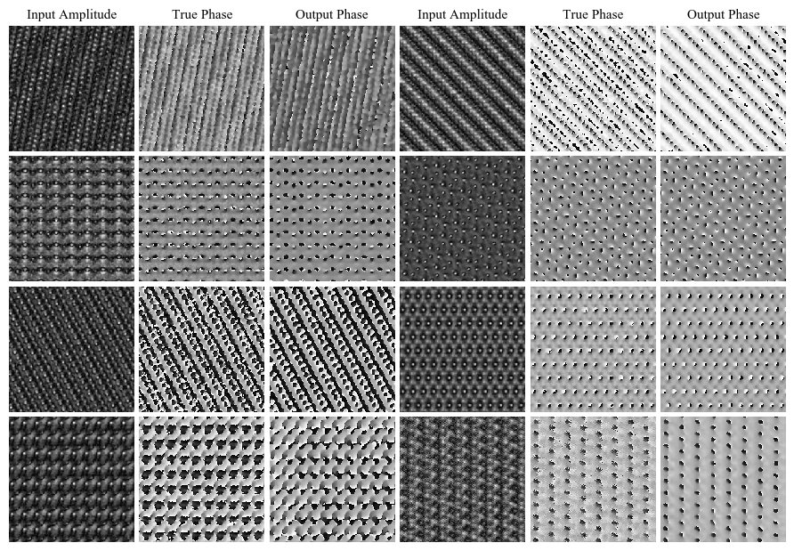

# Exit Wavefunction Reconstruction from Single Transmisson Electron Micrographs with Deep Learning

Repository for the upcoming [paper](upcoming url!) "Exit Wavefunction Reconstruction from Single Transmisson Electron Micrographs with Deep Learning". 

One-shot exit wavefunction with deep learning uses neural networks to recover phases of conventional transmission electron microscopy images by restricting the distribution of wavefunctions. 

  

Figure: phases output by a neural network for input amplitudes are similar to true phases for In1.7K2Se8Sn2.28 wavefunctions. 

# Noteable Files

In the wavefunctions directory, subdirectories numbered 1,2,3, ..., snapshot neural networks as they were developed. After ~20 initial experiments, architecture was kept almost uncharged for the GAN and direct prediction. Networks featured in the paper include

**19**: n=1, multiple materials  
**39**: n=3, multiple materials

**24**: n=1, single material  
**38**: n=3, single material

**34**: n=1, single material, generative adversarial network  
**37**: n=3, single material, generative adversarial network

**40**: n=3, multiple materials, restricted simulation hyperparameters

A simple script to reconstruct focal series is in `wavefunctions/hologram_reconstruction_old_code.py`.

# Datasets

New datasets containing 98340 simulated wavefunctions, and 1000 experimental focal series available [here](https://warwick.ac.uk/fac/sci/physics/research/condensedmatt/microscopy/research/machinelearning).

# Pretrained Models

Last saved checkpoints for notable files are [here](https://mycloud-test.warwick.ac.uk/s/aSMfPetfg5pGWmH). Password: "W4rw1ck3m!" (without quotes). Note that the server is in a test phase, so it may be intermittently unavailable and the url will eventually change.
 
# clTEM

Multislice simulations were performed with clTEM. Simulations are GPU-accelerated, and are written in OpenCL/C++ for performance. Source code is maintained by Jon Peters and is available [here](https://github.com/JJPPeters/clTEM) with official releases.

Compiled versions of clTEM used in our research have been included

**clTEM_files**: n=1, Alternative physics  
**clTEM_file_0.2.4**: n=3, Standard physics
 
# Contact

Jeffrey M. Ede: j.m.ede@warwick.ac.uk - machine learning, general  
Jon J. P. Peters: j.peters.1@warwick.ac.uk - clTEM  
Richard Beanland: r.beanland@warwick.ac.uk
